# Baratheon Retail


## Overview
A retail website fufulling an intensive business requirement document as provided by a client. The website provides functionality for browsing/shopping a number of available products hosted on a third-party API.

This application comes out of the box ready to host.

## Table of Contents
* [Team](https://github.com/RFCE2209-Baratheon/Front-End-Capstone/edit/main/readme.md#team)
* [Tech Stack](https://github.com/huongnguyen04/dinner-party/blob/main/README.md#tech-stack)  
* [Product Features](https://github.com/huongnguyen04/dinner-party/blob/main/README.md#product-features)  
* [Installation](https://github.com/huongnguyen04/dinner-party/blob/main/README.md#installation)  


## Team
* Huong Nguyen - [Product Overview](https://github.com/RFCE2209-Baratheon/Front-End-Capstone/tree/overview6#product-overview)
* Mario Valencia - [Related Products](https://github.com/RFCE2209-Baratheon/Front-End-Capstone/tree/overview6#related-products)
* Andrew Arsenault - [Questions & Answers](https://github.com/RFCE2209-Baratheon/Front-End-Capstone/tree/overview6#questions--answers)
* Brian Stern - [Ratings & Reviews](https://github.com/RFCE2209-Baratheon/Front-End-Capstone/tree/overview6#ratings--reviews)


## Tech Stack


## Product Features

### Website Overview


Toggle Theme


## Product Overview

Product Image Carousel


Product Image Magnification


Style Selector
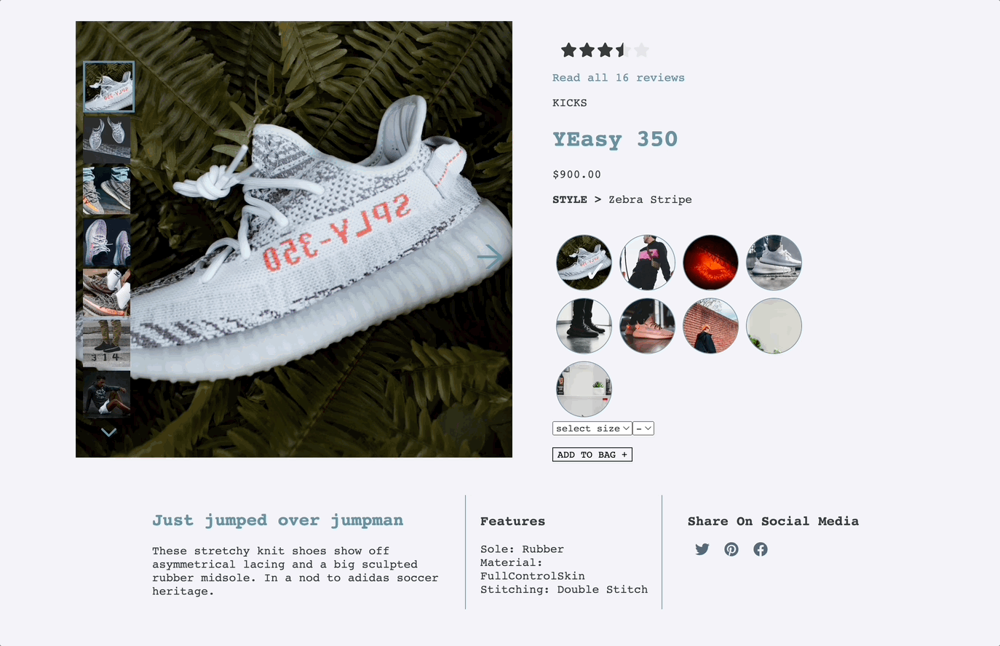

Add Product to Cart
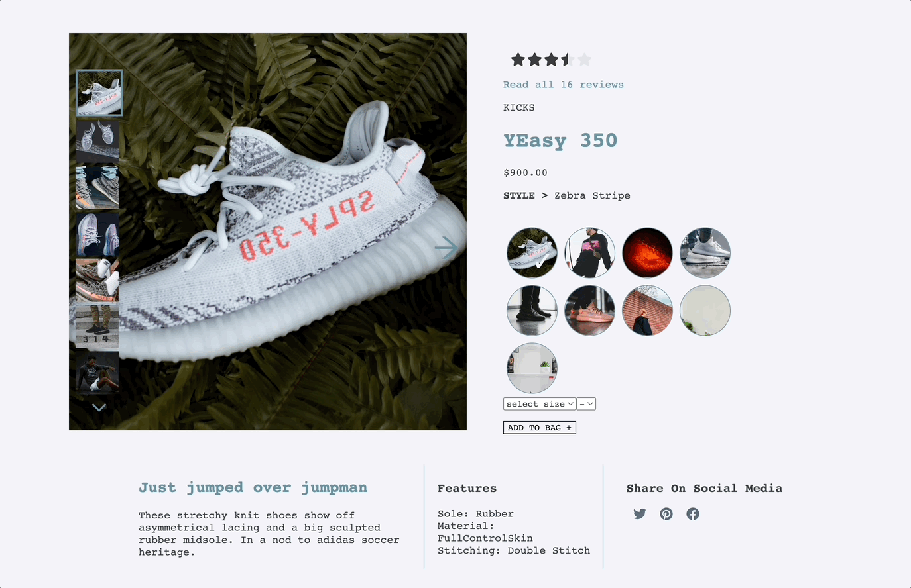

## Related Products

Related Product Selector


Related Products Cards


Related Products Carousel


Outfit Creation


## Questions & Answers

Load More Questions
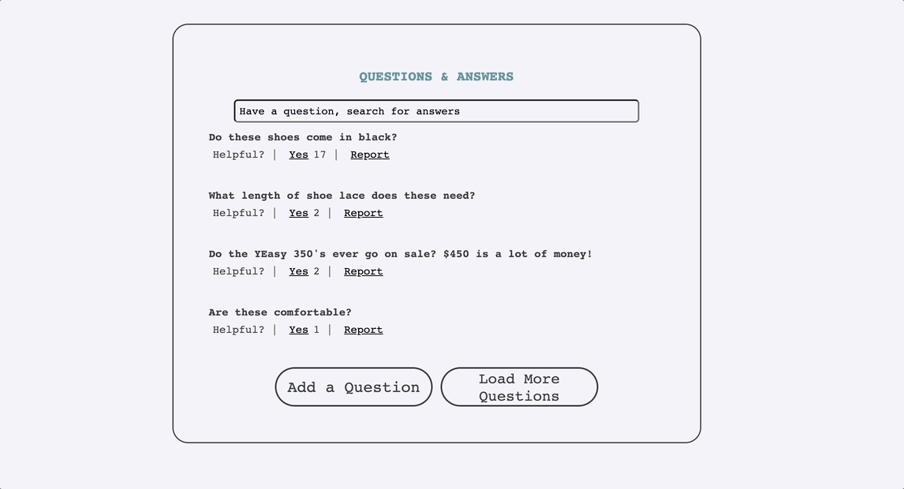

View Answers to Questions
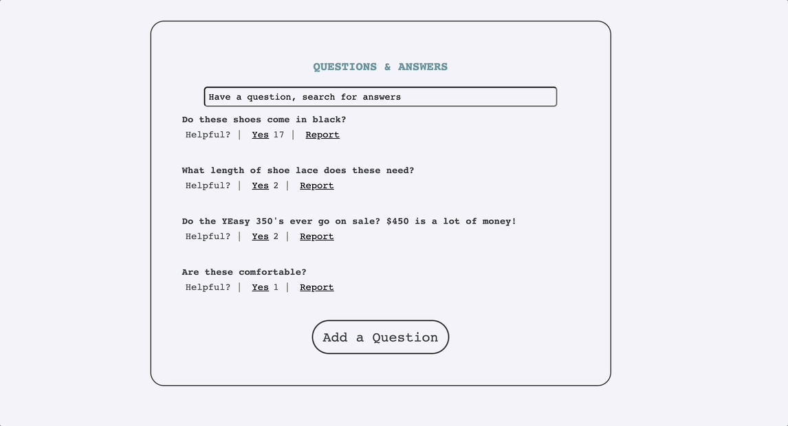

Search Questions and Answers
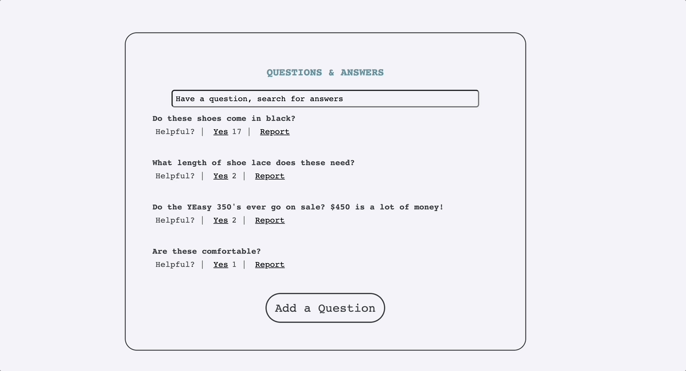

Vote Helpfulness of Question
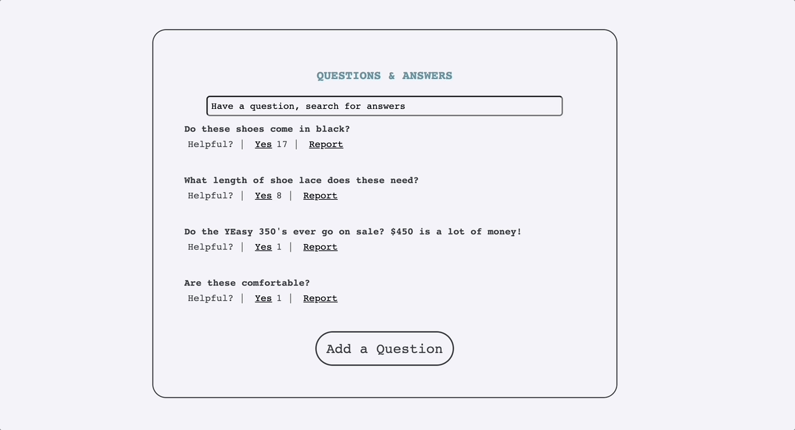

Report Question
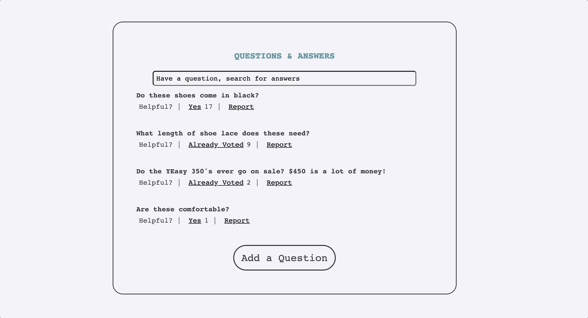

Add a Question
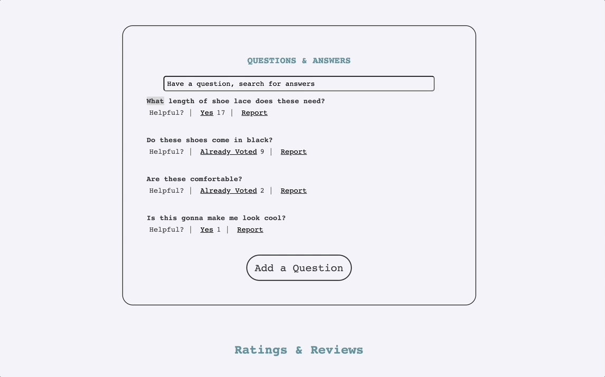

## Ratings & Reviews

Load More Reviews
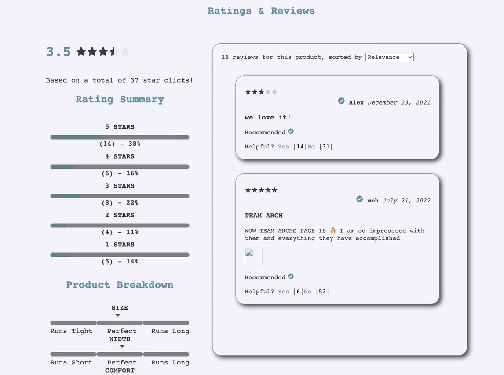

Vote Helpfulness of Review
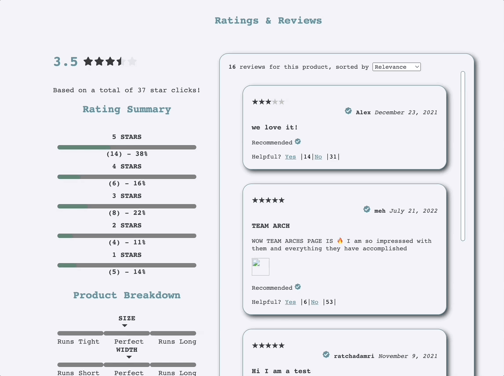

Sort Reviews by Category
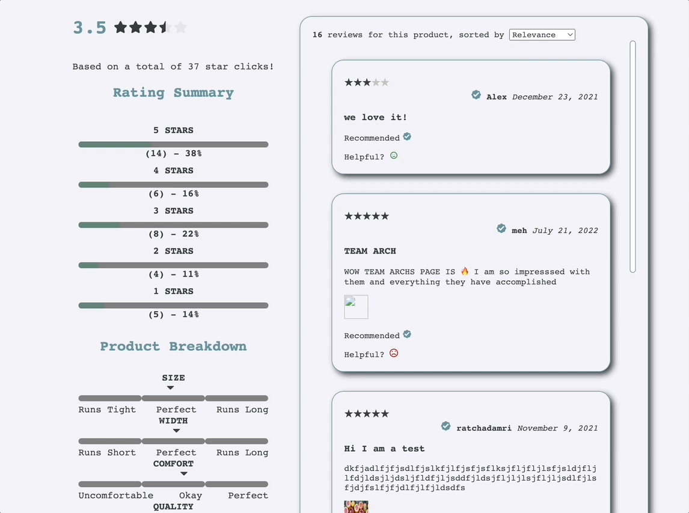

Sort Reviews by Rating
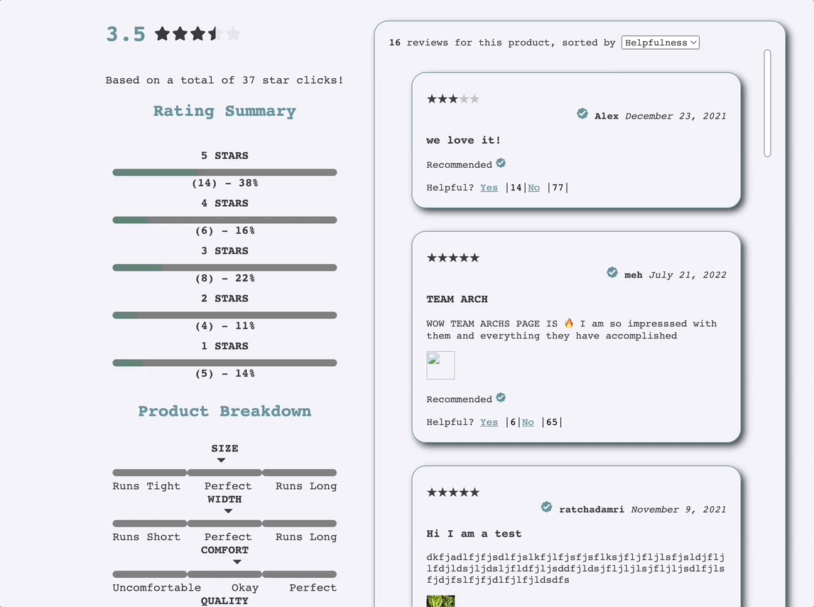

Add a Review

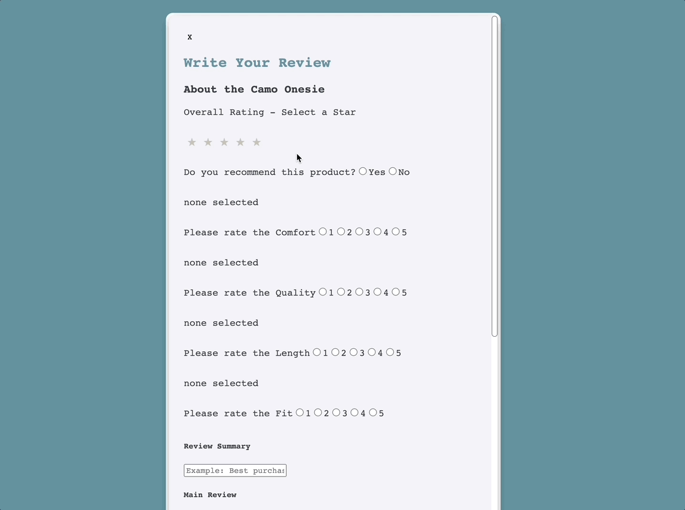

## Installation

### Starting the web application

Ensure that you have node working on version 16.8.2 or higher. If you do not you can install it here https://nodejs.org/en/download/


#### Running in Production
>To run the build package in production mode run the following

```
npm run build
```
#### Running in Development
>To run the build package in development mode run the following commands npm start

```
npm run start
```


#### Hosting

> Configuring the server

After you have built the project you may host locally or externally on a third-party hosting service.

The server, by default, is hosted locally on port 3000. Be sure that this port is available or configure it in the server/index.js file.

Additionally you will need to provide a github access token in order to request data from the API. This is stored in a config.js file in the main directory. The format to the config.js file should look something like the one below.

module.exports = { TOKEN: 'MyGitHubAPItoken' }

To run this locally simply run the follow command

```
npm run server-dev
```


### Requirements
(https://nodejs.org/en/download/)
